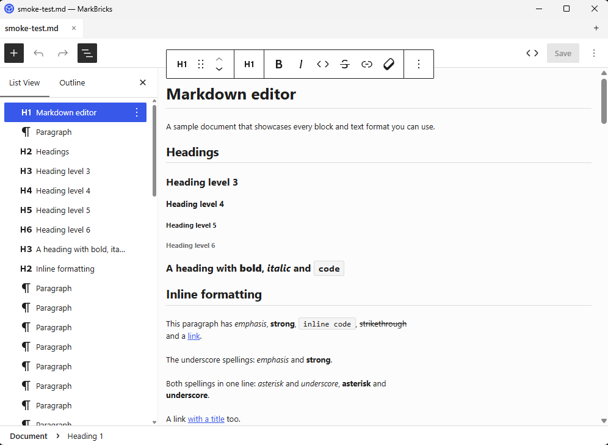
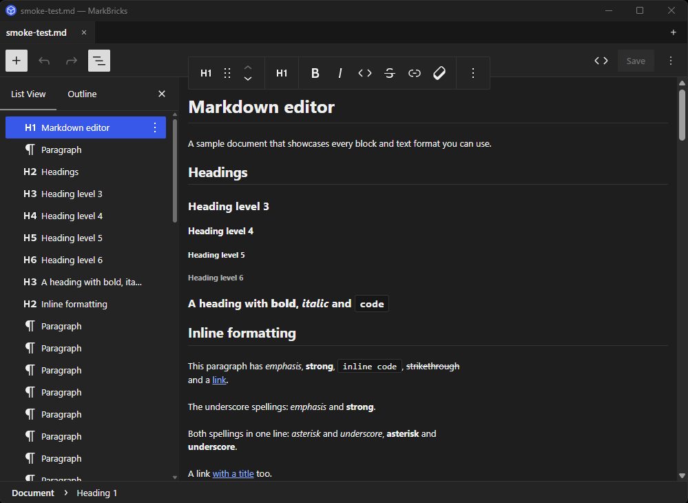
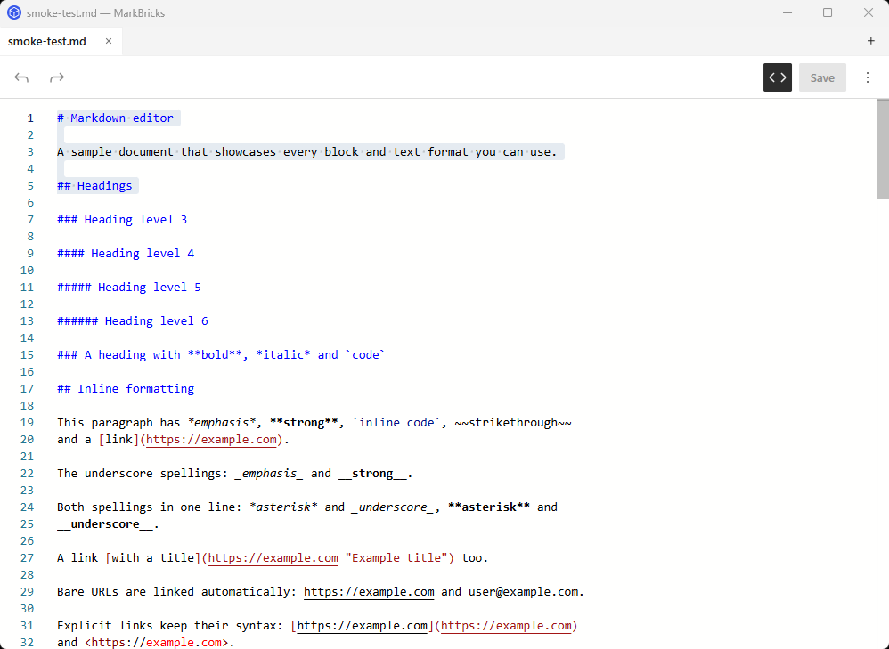
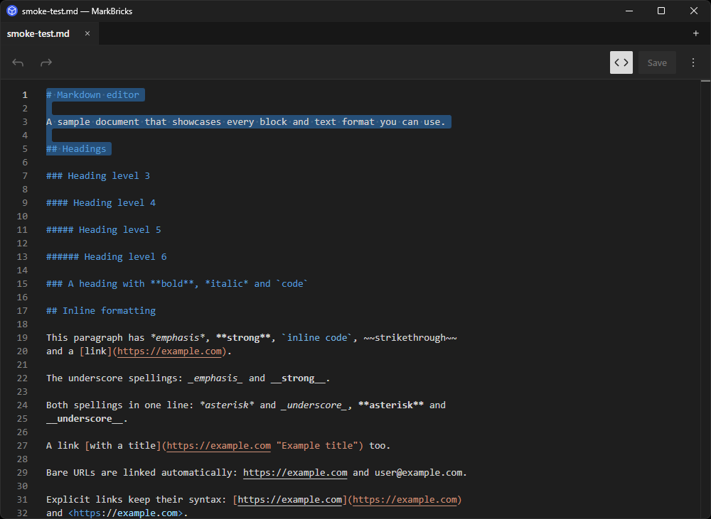

<p align="center">
  
</p>

# MarkBricks

[](https://github.com/t-hamano/mark-bricks/actions/workflows/type-check.yml)
[](https://github.com/t-hamano/mark-bricks/actions/workflows/js-unit-test.yml)
[](https://github.com/t-hamano/mark-bricks/actions/workflows/rust-unit-test.yml)
[](https://github.com/t-hamano/mark-bricks/actions/workflows/tauri-smoke-test.yml)

A visual Markdown editor that minimizes and specializes the WordPress block editor for Markdown editing.

| Light                                                            | Dark                                                           |
| ---------------------------------------------------------------- | -------------------------------------------------------------- |
|  |  |
|      |      |

## Products

MarkBricks is delivered as the following applications.

- **MarkBricks Desktop** — A standalone desktop app for Windows, macOS, and Linux. Built on Tauri 2 + React, it edits local Markdown files with the WordPress block editor. Grab it from the [Download](#download) section below.
- **MarkBricks VSCode extension** — A VSCode extension that embeds the editor as a custom editor for `.md` files, so you can edit Markdown visually without leaving your editor. Install it from the [VSCode Marketplace](https://marketplace.visualstudio.com/items?itemName=aki-hamano.mark-bricks-vscode); see [`apps/vscode`](apps/vscode) to build it from source.

## Download

Download **MarkBricks Desktop** for your platform. Older versions and release notes are on the [Releases page](https://github.com/t-hamano/mark-bricks/releases). Installers are currently unsigned; Windows builds are planned to be signed via the [SignPath Foundation](https://signpath.org), and macOS builds via the Apple Developer Program — see the [code signing policy](CODE_SIGNING_POLICY.md) for details.

| Platform | Download                                                                                                                                                                         |
| -------- | -------------------------------------------------------------------------------------------------------------------------------------------------------------------------------- |
| Windows  | <!-- download:windows -->[Installer (`.exe`)](https://github.com/t-hamano/mark-bricks/releases/download/tauri-v0.13.0/MarkBricks_0.13.0_x64-setup.exe)<!-- /download:windows --> |
| macOS    | <!-- download:macos -->[Disk image (`.dmg`)](https://github.com/t-hamano/mark-bricks/releases/download/tauri-v0.13.0/MarkBricks_0.13.0_universal.dmg)<!-- /download:macos -->    |
| Linux    | <!-- download:linux -->[AppImage](https://github.com/t-hamano/mark-bricks/releases/download/tauri-v0.13.0/MarkBricks_0.13.0_amd64.AppImage)<!-- /download:linux -->              |

## Structure

This is a pnpm monorepo. The editor itself lives in a host-agnostic package that each host application consumes.

- **[`apps/tauri`](apps/tauri)** — Desktop application. Built on Tauri 2 + React, it hosts `@mark-bricks/editor` for editing local Markdown files.
- **[`apps/vscode`](apps/vscode)** — VSCode extension. Embeds the editor as a custom editor for `.md` files.
- **[`packages/editor`](packages/editor)** — `@mark-bricks/editor`. The host-agnostic React component at the heart of MarkBricks. Ships the blocks, inline formats, a Monaco-based source editor, and i18n.
- **[`packages/i18n-tools`](packages/i18n-tools)** — `@mark-bricks/i18n-tools`. Shared i18n build tooling. Provides the `mb-i18n` CLI that runs the gettext PO/JSON pipeline.
- **[`packages/fixtures`](packages/fixtures)** — `@mark-bricks/fixtures`. Shared Markdown fixtures consumed by Storybook, the round-trip tests, and manual smoke tests.
- **[`storybook`](storybook)** — Storybook workspace for previewing the editor.

## Storybook

Here you can see the core `@mark-bricks/editor` in action.

<https://t-hamano.github.io/mark-bricks/>

## Development

Requires Node.js and [pnpm](https://pnpm.io/). Run any of the root scripts with `pnpm <script>`.

### Install

```sh
# Install dependencies
pnpm install
```

### Storybook

```sh
# Start Storybook
pnpm storybook
```

### i18n

```sh
# Extract translatable strings to .pot
pnpm i18n:make-pot
# Sync per-locale .po files
pnpm i18n:make-po
# Build the Jed-format .json dictionaries
pnpm i18n:make-json
```

### Test

```sh
# Run the test suites across packages
pnpm test
```

For running, building, and versioning a specific app, see its own README ([`apps/tauri`](apps/tauri/README.md), [`apps/vscode`](apps/vscode/README.md)).

## License

[GPL-2.0-or-later](LICENSE) © Aki Hamano
