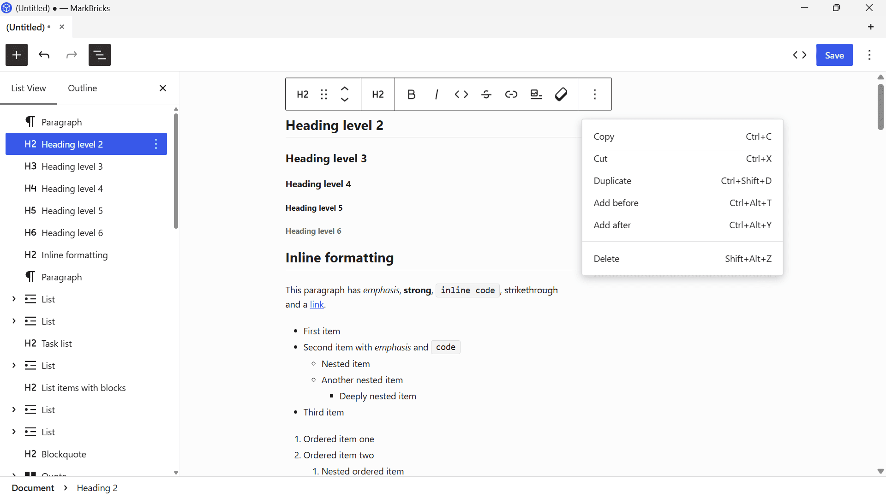
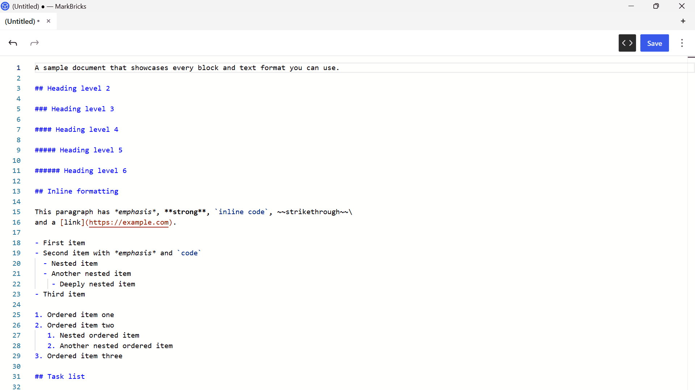
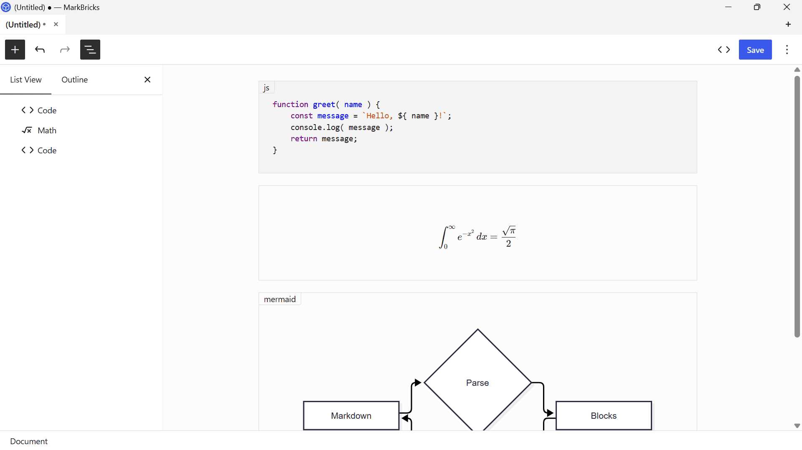
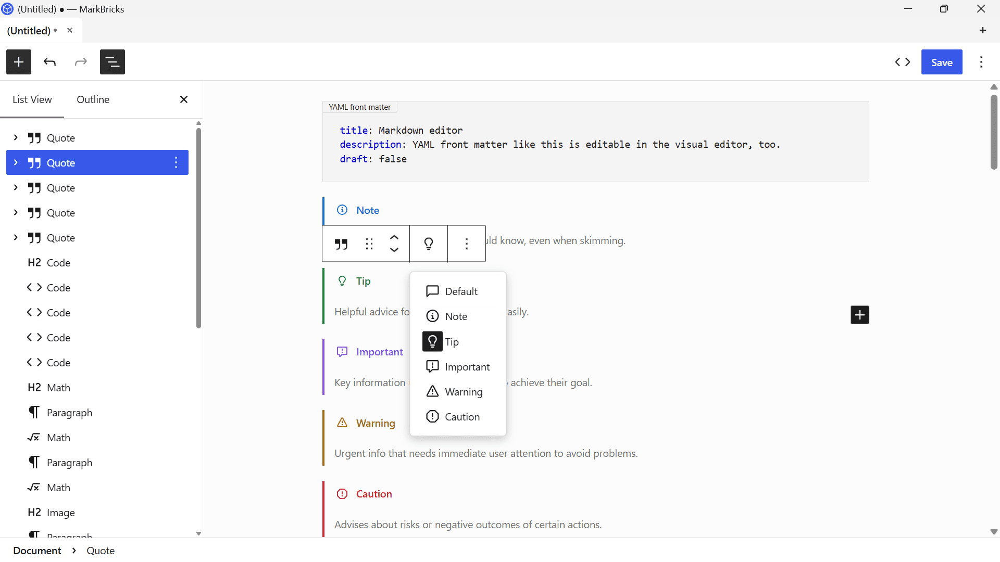
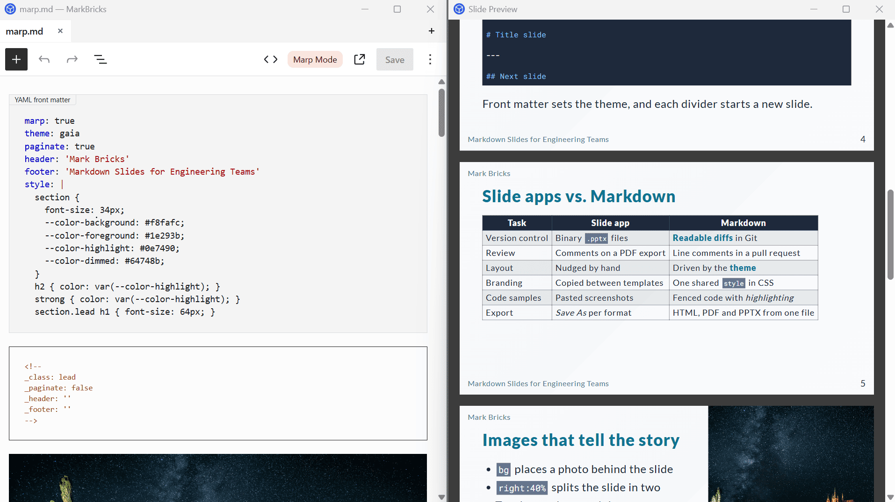
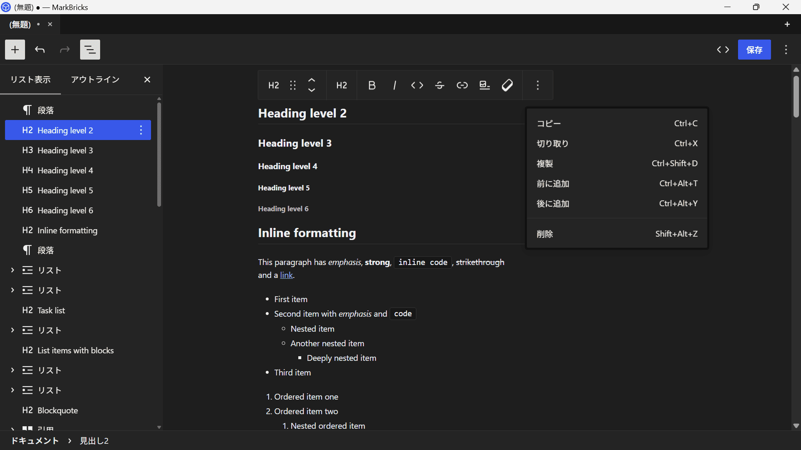

<p align="center">
  
</p>

# MarkBricks

[](https://github.com/t-hamano/mark-bricks/actions/workflows/type-check.yml)
[](https://github.com/t-hamano/mark-bricks/actions/workflows/js-unit-test.yml)
[](https://github.com/t-hamano/mark-bricks/actions/workflows/rust-unit-test.yml)
[](https://github.com/t-hamano/mark-bricks/actions/workflows/tauri-smoke-test.yml)
[](https://github.com/t-hamano/mark-bricks/actions/workflows/vscode-smoke-test.yml)

A visual Markdown editor that minimizes and specializes the WordPress block editor for Markdown editing.

## Products

MarkBricks is delivered as the following applications.

- **MarkBricks Desktop** — A standalone desktop app for Windows, macOS, and Linux. Built on Tauri 2 + React, it edits local Markdown files with the WordPress block editor. Grab it from the [Download](#download) section below.
- **MarkBricks VSCode extension** — A VSCode extension that embeds the editor as a custom editor for `.md` files, so you can edit Markdown visually without leaving your editor. Install it from the [VSCode Marketplace](https://marketplace.visualstudio.com/items?itemName=aki-hamano.mark-bricks-vscode); see [`apps/vscode`](apps/vscode) to build it from source.

## Features

### Block-based editing



Every Markdown element is a block you can drag, reorder, duplicate, or transform. The List View and Outline show the document structure. Files stay plain `.md`, and the editor keeps the syntax you chose (`*` or `_`, `-` or `*`, backtick or tilde fences), so saving never rewrites a file. Switch to the text editor at any time to edit the source.

### Text editor



The text editor runs on Monaco, the editor behind VS Code. Pressing Enter continues lists, task lists, and quotes, and Backspace removes the whole marker at once. In MarkBricks Desktop, you can set the theme, font size, tab size, and line numbers.

### Live preview for diagrams and math



Mermaid diagrams and TeX math (rendered with KaTeX) preview right in the document and update as you type. Select the block to edit its source, and click away to see only the result. Math is saved as `$$`, which GitHub, VS Code, and Marp also display. Other code blocks get syntax highlighting.

### Front matter and GitHub-style alerts



YAML front matter and GitHub-style alerts (`> [!NOTE]`) can be edited in the visual editor too.

### Marp slide preview



MarkBricks previews [Marp](https://marp.app/) slide decks. When a document's front matter contains `marp: true`, the editor header shows **Marp Mode**, and a **Preview Slides** button opens the slides:

- **Desktop**: the button in the header opens them in a separate window.
- **VSCode**: the button in the editor title bar opens them beside the editor, from both the text editor and the visual editor.

For an example deck that uses directives, split backgrounds, image filters, tables and math, see [`marp.md`](packages/fixtures/markdown/marp.md).

### Light and dark themes, in your language



Both apps work in light and dark themes, and the interface is translated into 13 languages.

## Download

Download **MarkBricks Desktop** for your platform. Older versions and release notes are on the [Releases page](https://github.com/t-hamano/mark-bricks/releases). macOS builds are signed with a Developer ID and notarized by Apple. Windows and Linux installers are currently unsigned; Windows builds are planned to be signed via the [SignPath Foundation](https://signpath.org) — see the [code signing policy](CODE_SIGNING_POLICY.md) for details.

| Platform | Download                                                                                                                                                                         |
| -------- | -------------------------------------------------------------------------------------------------------------------------------------------------------------------------------- |
| Windows  | <!-- download:windows -->[Installer (`.exe`)](https://github.com/t-hamano/mark-bricks/releases/download/tauri-v0.16.0/MarkBricks_0.16.0_x64-setup.exe)<!-- /download:windows --> |
| macOS    | <!-- download:macos -->[Disk image (`.dmg`)](https://github.com/t-hamano/mark-bricks/releases/download/tauri-v0.16.0/MarkBricks_0.16.0_universal.dmg)<!-- /download:macos -->    |
| Linux    | <!-- download:linux -->[AppImage](https://github.com/t-hamano/mark-bricks/releases/download/tauri-v0.16.0/MarkBricks_0.16.0_amd64.AppImage)<!-- /download:linux -->              |

## Structure

This is a pnpm monorepo. The editor itself lives in a host-agnostic package that each host application consumes.

- **[`apps/tauri`](apps/tauri)** — Desktop application. Built on Tauri 2 + React, it hosts `@mark-bricks/editor` for editing local Markdown files.
- **[`apps/vscode`](apps/vscode)** — VSCode extension. Embeds the editor as a custom editor for `.md` files.
- **[`packages/editor`](packages/editor)** — `@mark-bricks/editor`. The host-agnostic React component at the heart of MarkBricks. Ships the blocks, inline formats, a Monaco-based source editor, and i18n.
- **[`packages/image-path`](packages/image-path)** — `@mark-bricks/image-path`. Shared, dependency-free parser for Markdown image paths and URLs, used by the Tauri and VSCode hosts to resolve images against the document.
- **[`packages/marp-preview`](packages/marp-preview)** — `@mark-bricks/marp-preview`. Renders Marp slide decks for the hosts' slide previews, with images resolved by each host.
- **[`packages/i18n-tools`](packages/i18n-tools)** — `@mark-bricks/i18n-tools`. Shared i18n build tooling. Provides the `mb-i18n` CLI that runs the gettext PO/JSON pipeline.
- **[`packages/fixtures`](packages/fixtures)** — `@mark-bricks/fixtures`. Shared Markdown fixtures consumed by Storybook, the round-trip tests, and manual smoke tests.
- **[`storybook`](storybook)** — Storybook workspace for previewing the editor.

## Storybook

Here you can see the core `@mark-bricks/editor` in action.

<https://t-hamano.github.io/mark-bricks/>

## Development

Requires Node.js and [pnpm](https://pnpm.io/). Run any of the root scripts with `pnpm <script>`.

### Install

```sh
# Install dependencies
pnpm install
```

### Storybook

```sh
# Start Storybook
pnpm storybook

# Build Storybook and run the visual regression tests in the Playwright Docker image, as CI does
pnpm --filter @mark-bricks/storybook test:visual:docker

# Update the baseline screenshots
pnpm --filter @mark-bricks/storybook test:visual:docker --update-snapshots
```

### i18n

```sh
# Extract translatable strings to .pot
pnpm i18n:make-pot
# Sync per-locale .po files
pnpm i18n:make-po
# Build the Jed-format .json dictionaries
pnpm i18n:make-json
```

### Test

```sh
# Run the test suites across packages
pnpm test
```

For running, building, and versioning a specific app, see its own README ([`apps/tauri`](apps/tauri/README.md), [`apps/vscode`](apps/vscode/README.md)).

## License

[GPL-2.0-or-later](LICENSE) © Aki Hamano
