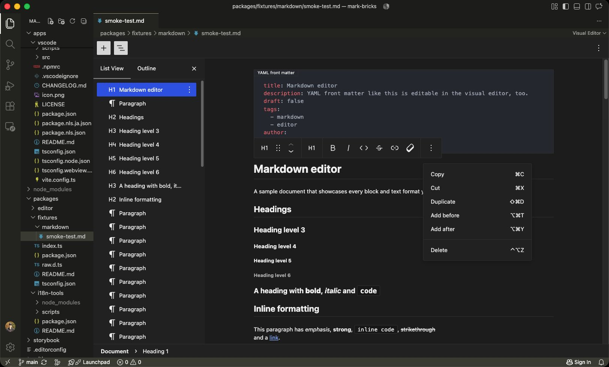
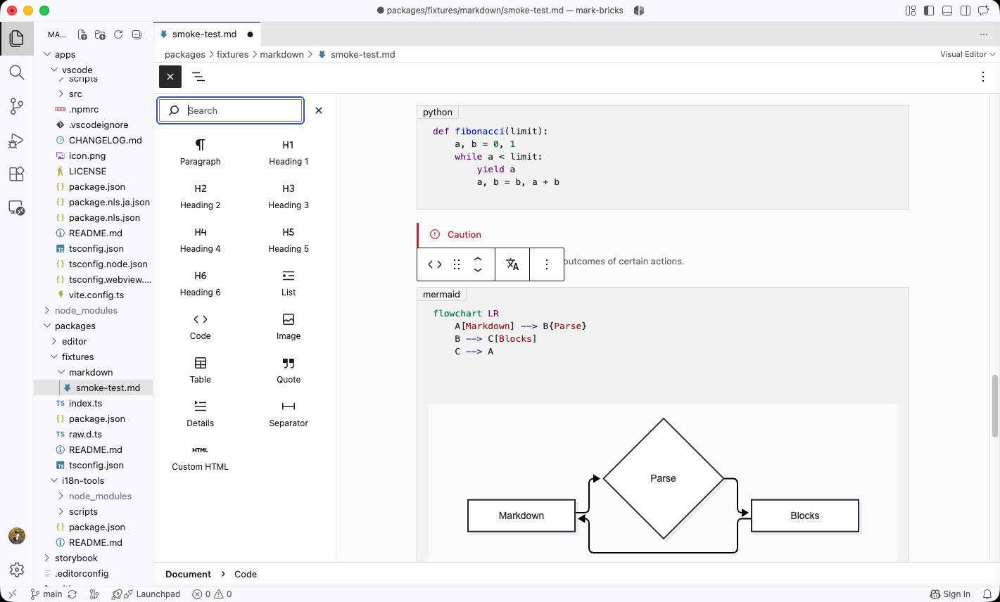
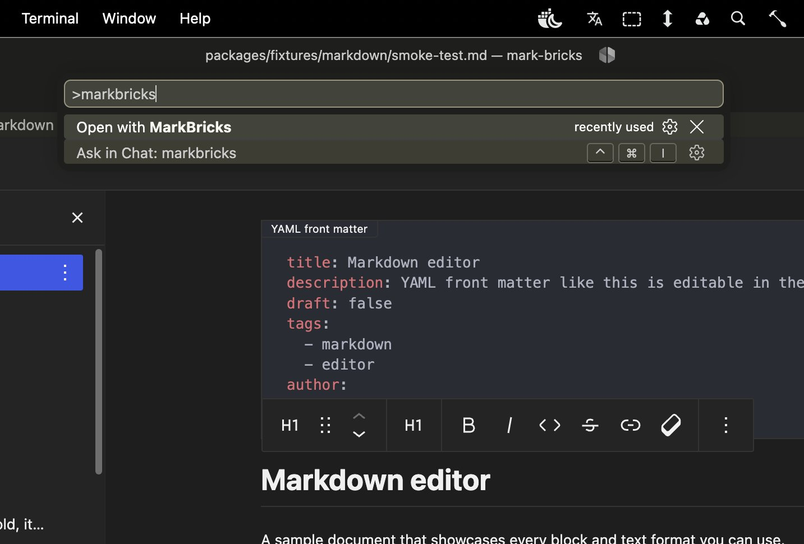
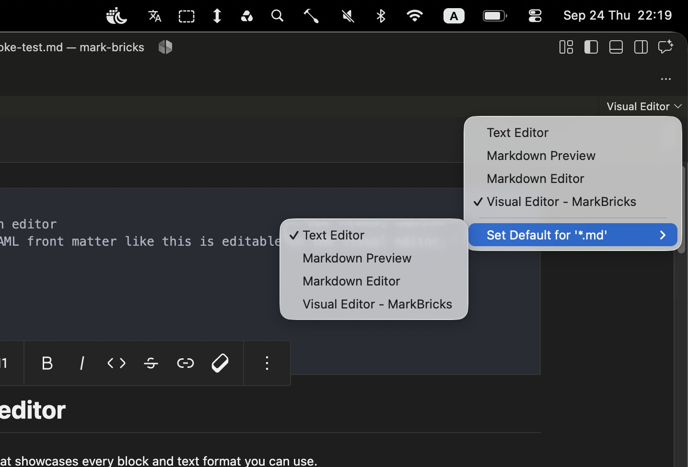

# MarkBricks

Edit Markdown visually in VSCode with the WordPress block editor. MarkBricks opens `.md` files in a visual editor where every paragraph, heading, list, and code fence is a block you can move, transform, and format. It saves the result back as plain Markdown.

## Features

- **Block-based editing**: Paragraphs, headings, lists, quotes, code, images, tables, details, separators, and custom HTML are all blocks. Drag them, move them up and down, duplicate them, or turn one type into another.
- **Inline formatting**: Bold, italic, inline code, strikethrough, links, and inline images from the block toolbar or keyboard shortcuts.
- **List View and Outline**: Browse the document structure and jump to any block or heading.
- **Code blocks with previews**: Syntax highlighting for fenced code, plus a live preview for Mermaid diagrams.
- **GitHub-style alerts and YAML front matter**: Edit both in the visual editor too.
- **Plain Markdown in, plain Markdown out**: Your files stay ordinary `.md` files that any other tool can read.
- **Follows your VSCode theme**: Works in light and dark themes.

## Usage

Open a Markdown file, then run **Open with MarkBricks** from the Command Palette. To go back to the source, run **Open with Text Editor**.

You can also switch editors from the editor title bar. To open every Markdown file in MarkBricks by default, choose **Set Default for '\*.md'** > **Visual Editor - MarkBricks** there.

## Settings

- `markBricks.showListViewByDefault`: Open the List View panel by default. Default: `false`
- `markBricks.showBlockBreadcrumbs`: Display the block hierarchy trail at the bottom of the editor. Default: `true`
- `markBricks.topToolbar`: Access all block and document tools in a single place. Default: `false`
- `markBricks.spotlightMode`: Focus on one block at a time. Default: `false`
- `markBricks.contentWidth`: Maximum width of the content area, in pixels (400–1600). Default: `700`
- `markBricks.fontSize`: Base font size of the content area, in pixels (10–24). Default: `13`
- `markBricks.fontFamily`: Typeface used for the content area: `system`, `sans-serif`, `serif`, `monospace`, or `handwriting`. Default: `system`
